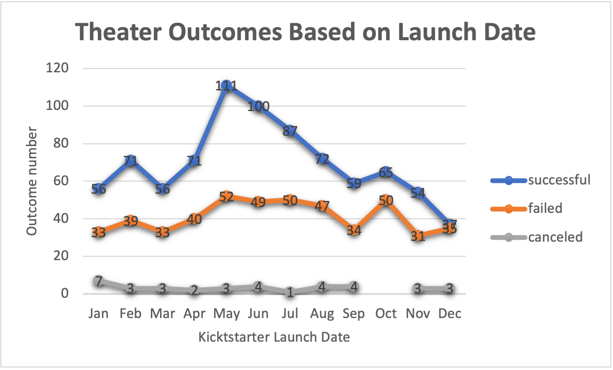
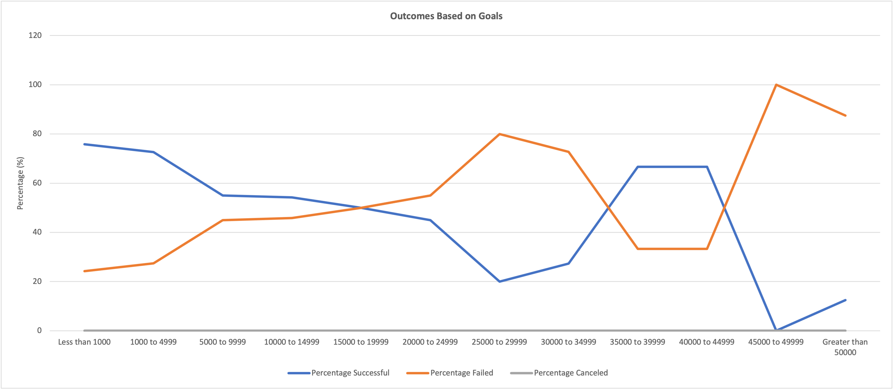

# Kickstarting with Excel

## Overview of Project
1. The project evaluates two variables - Funding goals and launch dates - that lead to success or failure of a Kickstarter programs focused on theater / plays. 

### Purpose
1. The purpose is to help Louise determine which variables will lead to a successful Kickstarter program for her new play idea. 

## Analysis and Challenges
    1. Analysis was performed by using a pivot table to observe trends in theater outcomes based upon launch date. 

    2. A line chart was used to evaluate outcomes based upon financial goals.  

* There were no challenges encountered during analysis of the data but extrapolation of the information may need to be adjusted on a country-by-country basis depending on demographics and other interests. 

### Analysis of Outcomes Based on Launch Date

### Analysis of Outcomes Based on Goals

### Challenges and Difficulties Encountered

## Results

- What are two conclusions you can draw about the Outcomes based on Launch Date?
    * 1 - Theater outcomes are more likely to be succeed rather than fail throughout the year.  
    * 2 - It can also be observed, however, that outcomes are more successful when launched in May or June with progressive worsening throughout the year. 

- What can you conclude about the Outcomes based on Goals?
    * It can be observed that outcomes have higher percentage of success - greater than 50% - when goals are less than $20,000.  Failure rate is directly related to financial goals with an inflection point noted at a goal of $30,000.

- What are some limitations of this dataset?
    * Limitations of the dataset include not having a comparision of countries (ie. US vs GB) which may impact the trends and conclusions. 

- What are some other possible tables and/or graphs that we could create?
    * Success and failure should be evaluated on a country-by-country basis due to different population demographics and interests.

